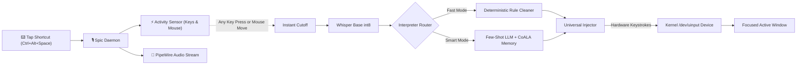

<div align="center">

# 🎙️ Spic
### *The Native, Privacy-First Voice Copilot for Linux (Wayland & X11)*

[](https://opensource.org/licenses/MIT)
[](https://www.python.org/)
[](https://ubuntu.com)
[](https://pipewire.org/)
[](https://ollama.com)

**Speak anywhere. Type everywhere.**  
Spic is a lightweight background daemon that brings an effortless voice typing experience natively to Linux desktops with zero cloud dependencies, "Tap-to-Start, Action-to-Finish" gesture termination, cognitive multi-agent memory, and kernel-level hardware typing.

---

</div>

## ✨ Key Features

- ⚡ **Tap-to-Start, Action-to-Finish:** Tap hotkey once to speak. Hands remain 100% free. Spic finishes and types the instant you **press any key**, **move your mouse**, or **pause speaking**!
- 🔒 **100% Local & Private:** Runs completely on your machine via CPU-quantized Whisper (`faster-whisper` `int8`) and local Ollama SLMs (`llama3.2:3b`). Zero audio is sent over the internet.
- 🪄 **Few-Shot Conversational Self-Corrections:** Automatically detects spoken clause retries (*"select screenshot in the left drawer from the drawer"* $\to$ *"Select screenshot from the drawer"*).
- 🧠 **CoALA Multi-Agent Cognitive Memory:** 4-tier persistent memory (Semantic, Episodic, Procedural, Working) with SQLite + FTS5 search, exponential temporal decay, and hybrid utility scoring.
- ⌨️ **Native Wayland & X11 Support:** Uses Linux Kernel `/dev/uinput` virtual hardware keyboards to bypass Wayland window isolation, typing seamlessly in VS Code, Terminal, Chrome, Slack, Discord, and LibreOffice.
- 🎨 **Ambient Translucent Wave HUD:** Minimalist 60 FPS floating overlay with physics-based spring drop transitions, reactive harmonic voice ribbons, and zero distracting text.
- 🌐 **Pluggable Cloud LLM Support:** Header-authenticated cloud API support (Groq at 500+ tok/s, Google Gemini, OpenAI, Claude, OpenRouter).
- 🛡️ **Hardened Linux Security:** Enforces `0700`/`0600` file permissions, Unix domain socket peer credential verification (`SO_PEERCRED`), and ANSI escape sequence sanitization.

---

## 🌊 Visual Interface & Wave States

```
┌─────────────────────────────────────────────────────────────┐
│ 1. 🎤 LISTENING WAVE (Audio Reactive Harmonic Ribbon)       │
│    Colors: Crimson Glow (#FF3B30) & Coral Sunset            │
│    Behavior: 3-layer composite sine splines dynamically     │
│    scale in real-time with your voice amplitude.            │
├─────────────────────────────────────────────────────────────┤
│ 2. 🧠 THINKING WAVE (Quantum Intelligence Flow)             │
│    Colors: Electric Cyan (#00F2FE) & Neon Violet            │
│    Behavior: Dual-traveling modulated wave ribbon           │
│    shimmering at 60 FPS while the model interprets.         │
├─────────────────────────────────────────────────────────────┤
│ 3. ✨ DONE WAVE (Harmonic Settle & Glow)                    │
│    Colors: Emerald Green (#10B981) & Mint Glow              │
│    Behavior: Calming harmonic wave that smoothly flattens   │
│    and glides upward out of view with spring physics.       │
└─────────────────────────────────────────────────────────────┘
```

---

## 🚀 Quickstart (4 Steps)

*For detailed distro-specific instructions, see the [Installation Guide](docs/installation.md).*

### 1. Clone and Install
```bash
git clone https://github.com/adarshacharya18/spic-voice-copilot.git
cd spic-voice-copilot

python3 -m venv .venv
source .venv/bin/activate
pip install -r requirements.txt
```

### 2. Configure Linux Hardware Typing
```bash
./scripts/setup_uinput.sh
```
*(If prompted, log out and log back in for `input` group permissions to take effect).*

### 3. Register Desktop Shortcuts
```bash
python3 -m spic.cli setup-shortcuts
```

### 4. Enable Background Autostart on Boot
```bash
python3 -m spic.cli autostart --enable
```
*Spic is now running in the background and will start automatically every time you boot your computer!*

---

## ⌨️ Hotkeys & Dictation Modes (Tap-to-Start, Action-to-Finish)

| Default Hotkey | Mode | Latency | Description & Behavior |
|---|---|---|---|
| **`Ctrl + Alt + Space`** | **Fast Voice Dictation** | `<300ms` | Single tap to start. Instant rule cleaner with verbal punctuation and deletions. Auto-finishes on **speech pause**, **any key press**, or **mouse move**! |
| **`Ctrl + Super + Space`** | **Smart Voice Copilot** | `~2-3s` | Single tap to start. Deep LLM interpretation (`llama3.2:3b` / Cloud) with conversational self-corrections. Auto-finishes on **speech pause**, **any key press**, or **mouse move**! |

### How It Works:
1. **Tap shortcut once:** Spic immediately opens the floating wave HUD and begins listening.
2. **Speak naturally:** Hands are 100% free (no keys held down).
3. **Finish instantly:** The moment you **press any key** (e.g. `Space`, `Enter`), **move your mouse** ($>15\text{px}$), or **pause speaking**, Spic instantly stops recording and types your text at the cursor!

### Customize Your Shortcuts:
```bash
# 1. Interactive configuration wizard with conflict detection
python3 -m spic.cli shortcuts

# 2. View all free & available hotkeys on your desktop
python3 -m spic.cli shortcuts --list-free

# 3. Check if a specific shortcut has system conflicts
python3 -m spic.cli shortcuts --check "ctrl+alt+m"
```

---

## 🧠 Cognitive Memory CLI

```bash
# Store user preference or fact
python3 -m spic.cli memory --add "I prefer PyTorch and Python for ML code" --type semantic --key "ml_pref" --importance 0.9

# Search memory
python3 -m spic.cli memory --search "machine learning preferences"

# Prune old / stale memories
python3 -m spic.cli memory --prune --max-age-days 90
```

---

## 🧪 CLI Diagnostics & Tools

```bash
# Test microphone levels via PipeWire
python3 -m spic.cli test-mic

# Test local Speech-to-Text inference
python3 -m spic.cli test-stt

# Test self-correction & rule cleaner
python3 -m spic.cli test-rules

# Test smart LLM interpretation with few-shot prompt
python3 -m spic.cli test-llm --input "select screenshot in the left drawer from the drawer"

# Test hardware text injection into active window
python3 -m spic.cli test-injection --text "✨ Spic Hardware Injection Working!"
```

---

## ⚙️ Configuration

Spic is configured via `~/.config/spic/config.json`:

```json
{
  "stt": {
    "engine": "faster-whisper",
    "model_size": "base.en",
    "device": "cpu",
    "compute_type": "int8"
  },
  "llm": {
    "provider": "ollama",
    "model": "llama3.2:3b",
    "base_url": "http://localhost:11434"
  },
  "shortcuts": {
    "fast_dictation": "<Control><Alt>space",
    "smart_copilot": "<Control><Super>space"
  }
}
```

*For complete configuration options and cloud providers (Groq, Gemini, Claude, OpenAI), see the [Configuration Guide](docs/configuration.md).*

---

## 🏛️ System Architecture



*For in-depth architectural details and sequence flows, see [docs/architecture.md](docs/architecture.md).*

---

## 📚 Documentation Index

- [Installation & Linux Distro Setup Guide](docs/installation.md)
- [Technical Architecture & Design](docs/architecture.md)
- [CoALA Cognitive Memory Architecture](docs/memory.md)
- [Configuration Reference](docs/configuration.md)
- [Troubleshooting & FAQ](docs/troubleshooting.md)
- [Security Architecture & Threat Model](docs/security.md)
- [Contributing Guidelines](CONTRIBUTING.md)

---

## 📜 License

Spic is open-source software licensed under the **[MIT License](LICENSE)**.
