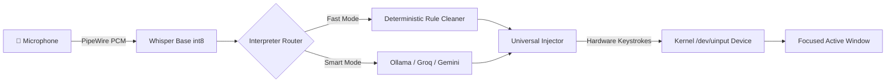

<div align="center">

# 🎙️ Spic
### *The Native, Privacy-First Voice Copilot for Linux (Wayland & X11)*

[](https://opensource.org/licenses/MIT)
[](https://www.python.org/)
[](https://ubuntu.com)
[](https://pipewire.org/)
[](https://ollama.com)

**Speak anywhere. Type everywhere.**  
Spic is a lightweight background daemon that brings an Apple Intelligence / Wispr Flow voice experience natively to Linux desktops with zero cloud dependencies, instant voice self-corrections, and kernel-level hardware typing.

---

</div>

## ✨ Key Features

- 🔒 **100% Local & Private:** Runs completely on your machine via CPU-quantized Whisper (`faster-whisper` `int8`) and local Ollama SLMs (`llama3.2:3b`). Zero audio is sent over the internet.
- ⚡ **Ultra-Low Latency (<300ms):** Fast dictation mode transcribes and types your speech in milliseconds.
- 🪄 **Smart Voice Self-Corrections:** Correct yourself mid-sentence naturally (*"I was working till 8pm, no make it 9pm"*) — Spic automatically applies the correction and removes the mistake.
- ⌨️ **Native Wayland & X11 Support:** Uses Linux Kernel `/dev/uinput` virtual hardware keyboards to bypass Wayland window isolation, allowing seamless typing in VS Code, Terminal, Chrome, Slack, Discord, and LibreOffice without window freezing.
- 🎨 **Ambient Fluid Wave HUD:** Minimalist 60 FPS floating pill overlay with physics-based spring drop transitions, reactive harmonic voice ribbons, and zero distracting text.
- 🌐 **Pluggable Cloud LLM Support:** Optional zero-latency cloud API support (Groq at 500+ tok/s, Google Gemini, OpenAI, Claude).
- 🛡️ **Hardened Linux Security:** Enforces `0700`/`0600` config permissions, Unix domain socket peer credential verification (`SO_PEERCRED`), and ANSI escape sequence sanitization.

---

## 🌊 Visual Interface & Wave States

```
┌─────────────────────────────────────────────────────────────┐
│ 1. 🎤 LISTENING WAVE (Audio Reactive Harmonic Ribbon)       │
│    Colors: Crimson Glow (#FF3B30) & Coral Sunset            │
│    Behavior: 3-layer composite sine splines dynamically     │
│    scale in real-time with your voice amplitude.            │
├─────────────────────────────────────────────────────────────┤
│ 2. 🧠 THINKING WAVE (Quantum Intelligence Flow)             │
│    Colors: Electric Cyan (#00F2FE) & Neon Violet            │
│    Behavior: Dual-traveling modulated wave ribbon           │
│    shimmering at 60 FPS while the model interprets.         │
├─────────────────────────────────────────────────────────────┤
│ 3. ✨ DONE WAVE (Harmonic Settle & Glow)                    │
│    Colors: Emerald Green (#10B981) & Mint Glow              │
│    Behavior: Calming harmonic wave that smoothly flattens   │
│    and glides upward out of view with spring physics.       │
└─────────────────────────────────────────────────────────────┘
```

---

## 🚀 Quickstart (3 Steps)

### 1. Clone and Install
```bash
git clone https://github.com/your-username/spic.git
cd spic

python3 -m venv .venv
source .venv/bin/activate
pip install -r requirements.txt
```

### 2. Configure Linux Hardware Typing
```bash
./scripts/setup_uinput.sh
```

### 3. Start Spic & Register Hotkeys
```bash
# Register GNOME system hotkeys
python3 -m spic.cli setup-shortcuts

# Start background daemon
./scripts/run_daemon.sh
```

---

## ⌨️ Hotkeys & Custom Shortcut Management

Spic includes an **intelligent hotkey manager** that scans active GNOME keybindings on your machine to guide you to 100% free shortcuts and prevent accidental desktop conflicts:

| Default Hotkey | Mode | Latency | Description |
|---|---|---|---|
| **`Ctrl + Alt + Space`** | **Fast Dictation** | `<300ms` | Instant voice typing with verbal punctuation (*"period"*, *"comma"*, *"new line"*) and instant deletions (*"scratch that"*). |
| **`Ctrl + Super + Space`** | **Smart Copilot** | `~2-3s` | Deep LLM interpretation using local `llama3.2:3b` or Cloud APIs. Formats bullet points, cleans grammar, and resolves complex self-corrections. |

### Customize Your Shortcuts:
```bash
# 1. Interactive configuration wizard with conflict detection
python3 -m spic.cli shortcuts

# 2. View all free & available hotkeys on your desktop
python3 -m spic.cli shortcuts --list-free

# 3. Check if a specific shortcut has system conflicts
python3 -m spic.cli shortcuts --check "ctrl+alt+m"

# 4. Directly assign custom shortcuts
python3 -m spic.cli shortcuts --fast "ctrl+alt+m" --smart "ctrl+super+k"
```

---

## 🧪 CLI Diagnostics & Tools

Spic comes with a comprehensive diagnostic suite:

```bash
# Test microphone levels via PipeWire
python3 -m spic.cli test-mic

# Test local Speech-to-Text inference
python3 -m spic.cli test-stt

# Test self-correction & rule cleaner
python3 -m spic.cli test-rules

# Test smart LLM interpretation
python3 -m spic.cli test-llm --input "I was working in the morning till 8pm. No make it 9pm."

# Test hardware text injection into active window
python3 -m spic.cli test-injection --text "✨ Spic Hardware Injection Working!"
```

---

## ⚙️ Configuration

Spic is configured via `~/.config/spic/config.json`:

```json
{
  "stt": {
    "engine": "faster-whisper",
    "model_size": "base.en",
    "device": "cpu",
    "compute_type": "int8"
  },
  "llm": {
    "provider": "ollama",
    "model": "llama3.2:3b",
    "base_url": "http://localhost:11434"
  },
  "ui": {
    "show_hud": true,
    "hud_width": 170,
    "hud_height": 42
  }
}
```

*For cloud providers (Groq, Gemini, OpenAI) and advanced settings, see the [Configuration Guide](docs/configuration.md).*

---

## 🏛️ System Architecture



*For in-depth architectural details and sequence flows, see [docs/architecture.md](docs/architecture.md).*

---

## 📚 Documentation Index

- [Technical Architecture & Design](docs/architecture.md)
- [Configuration Reference](docs/configuration.md)
- [Troubleshooting & FAQ](docs/troubleshooting.md)
- [Security Architecture & Threat Model](docs/security.md)
- [Contributing Guidelines](CONTRIBUTING.md)

---

## 📜 License

Spic is open-source software licensed under the **[MIT License](LICENSE)**.
