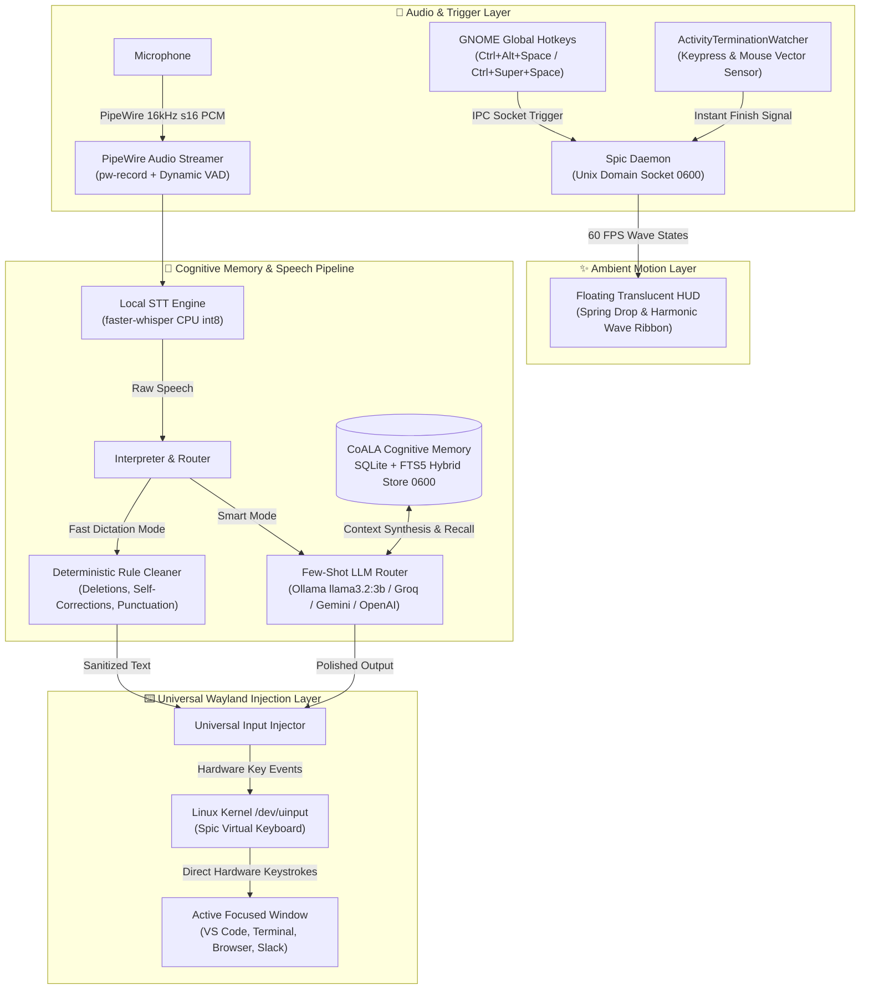

# 🏛️ Spic Technical Architecture & Design

**Spic** is an ultra-low latency, privacy-first voice copilot engineered specifically for Linux desktop environments (GNOME Wayland and X11). It seamlessly converts spoken voice into clean, polished, context-aware written text and types it directly into whichever application window currently has focus.

---

## 1. High-Level System Architecture

---

## 2. Core Subsystems

### A. Tap-to-Start, Action-to-Finish Engine (`spic.shortcuts`, `spic.daemon`)
- **Zero Key Holding:** Users tap `Ctrl + Alt + Space` or `Ctrl + Super + Space` once to activate. Hands remain completely free during speech.
- **Gesture & Hardware Termination:** The `ActivityTerminationWatcher` activates with a **250ms release grace period**:
  - The instant the user **presses any key** (e.g. `Space`, `Enter`, or resumes typing), **moves the mouse** ($>15\text{px}$ vector), or **clicks**, recording instantly terminates and triggers processing.
  - **Silence VAD Fallback:** If no manual action is taken, a 1.0s silence detector automatically finalizes the input.

### B. Non-Blocking Audio Capture (`spic.audio`)
- **Native PipeWire Streaming:** Uses `pw-record --rate 16000 --channels 1 --format s16 --raw -` to pipe raw mono PCM audio directly into a background consumer thread.
- **Dynamic Voice Activity Detection (VAD):** Continuous RMS energy tracking with exponential headroom calibration.

### C. Multi-Agent Cognitive Memory System (`spic.memory`)
Engineered according to the **CoALA (Cognitive Architectures for Language Agents)** framework:
- **4-Tier Memory Structure:**
  1. `SEMANTIC`: Long-term facts, user preferences, names, and coding styles.
  2. `EPISODIC`: Past interactions and contextual transcripts.
  3. `PROCEDURAL`: Spoken workflows and learned macros.
  4. `WORKING`: Short-term scratchpad context per active window/session.
- **Hybrid Search Scoring:**
  $$\text{Score} = 0.50 \cdot \text{Lexical FTS5} + 0.25 \cdot e^{-\lambda \Delta t} + 0.15 \cdot \text{Importance} + 0.10 \cdot \min(1.0, \frac{\text{Count}}{10})$$
- **Isolated SQLite Storage:** Persistent database at `~/.config/spic/memory/agent_memory.db` with WAL mode and POSIX `0600` permissions.

### D. Hybrid Speech Interpreter (`spic.interpreter`)
1. **Tier 1: Fast Rule Cleaner (`RuleCleaner`)**
   - **Latency:** `<1ms` (Zero delay).
   - **Features:** Deterministic verbal punctuation parsing (*"period"* -> `.`, *"comma"* -> `,`, *"new line"* -> `\n`), conversational phrase replacements (*"in the left drawer from the drawer"* -> *"from the drawer"*), spoken phrase deletions (*"scratch that"*), and verbal filler filtering (*"um"*, *"uh"*).
2. **Tier 2: Few-Shot Smart LLM Router (`LLMRouter`)**
   - **Unified Few-Shot Architecture:** Pre-loads high-signal conversational editing demonstrations into local and cloud LLM prompts, ensuring small local models (`llama3.2:3b`) execute phrase revisions reliably.
   - **Supported Backends:** Local Ollama, Groq, OpenAI, Anthropic, Google Gemini (via `x-goog-api-key` headers), and OpenRouter.

### E. Universal Wayland Text Injector (`spic.injector`)
- **Kernel Virtual Keyboard:** Emits hardware scancodes through `/dev/uinput` at **1.5ms per character** to type directly into focused applications without depending on X11 or XTest extensions.
- **Escape Sanitization:** Strips ANSI terminal escape sequences and unprintable control characters to prevent terminal command injection.

### F. Ambient Floating HUD (`spic.ui`)
- **Physics Transitions:** Features a spring-overshoot drop transition (`ease_out_back`) on activation and an upward glide collapse (`ease_in_cubic`) upon completion.
- **60 FPS Harmonic Waves:** Renders multi-layered composite sine splines with Gaussian edge envelope damping:
  - **Listening Wave:** Crimson Red (`#FF3B30`) & Coral Sunset audio-reactive harmonic splines.
  - **Thinking Wave:** Electric Cyan (`#00F2FE`) & Neon Purple traveling quantum flow ribbon.
  - **Done Wave:** Emerald Green (`#10B981`) settling pulse.

---

## 3. End-to-End Latency Profile

| Stage | Fast Dictation (`Ctrl+Alt+Space`) | Smart Copilot (`Ctrl+Super+Space`) |
|---|---|---|
| **Audio Capture & VAD** | Streamed in real-time | Streamed in real-time |
| **STT (Whisper Base CPU int8)** | ~250ms | ~250ms |
| **Interpretation** | <1ms (Rule Cleaner) | ~2.5s (Ollama) / ~250ms (Groq) |
| **Hardware Injection (uinput)** | ~50ms | ~50ms |
| **Total Roundtrip Latency** | **~300ms (Instantaneous)** | **~2.8s (Local) / ~550ms (Cloud)** |
