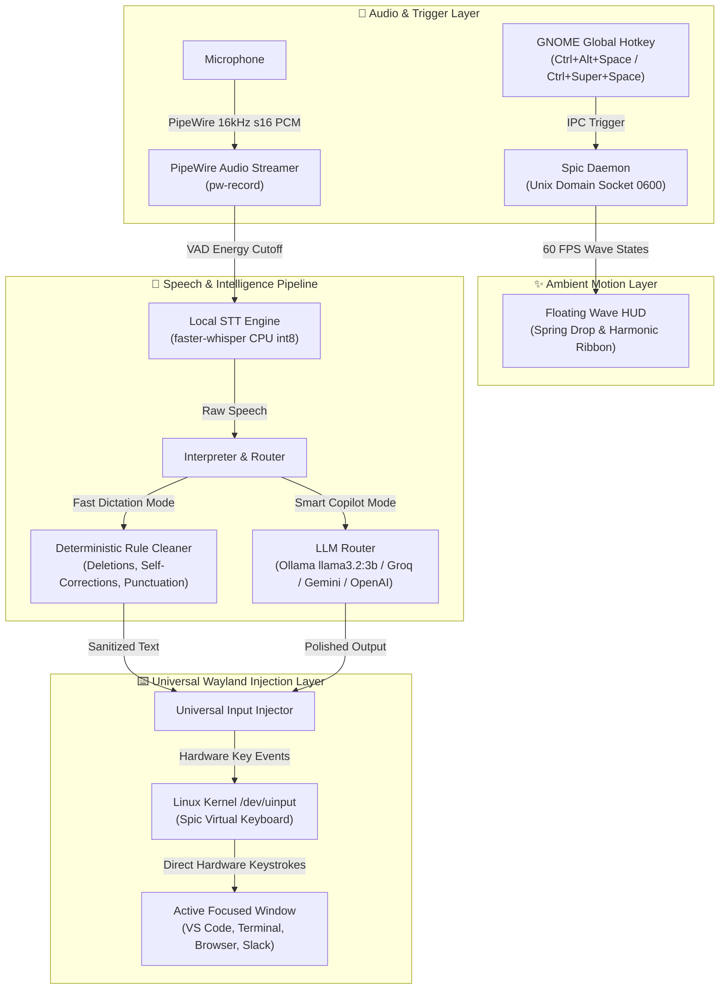

# 🏛️ Spic Technical Architecture & Design

**Spic** is an ultra-low latency, privacy-first voice copilot engineered specifically for Linux desktop environments (GNOME Wayland and X11). It seamlessly converts spoken voice into clean, polished, context-aware written text and types it directly into whichever application window currently has focus.

---

## 1. High-Level System Architecture

---

## 2. Core Subsystems

### A. Non-Blocking Audio Pipeline (`spic.audio`)
- **Native PipeWire Streaming:** Uses `pw-record --rate 16000 --channels 1 --format s16 --raw -` to pipe raw mono PCM audio directly into a background consumer thread. This avoids fragile C bindings (`PortAudio`) and integrates natively with modern Linux sound servers.
- **Voice Activity Detection (VAD):** Employs RMS energy tracking with exponential headroom calibration and a 4.0-second initial grace period, automatically stopping recording when the speaker pauses for >1.0 second.

### B. Local Speech-to-Text (`spic.stt`)
- **Engine:** `faster-whisper` powered by `CTranslate2`.
- **Quantization:** Runs `int8` CPU quantization with cached model weights.
- **Thread Throttling:** Capped to a maximum of 2 CPU threads to prevent CPU core starvation on multi-tasking desktop systems (e.g. Electron apps like VS Code).

### C. Hybrid Speech Interpreter (`spic.interpreter`)
Spic provides a two-tiered processing architecture:

1. **Tier 1: Fast Rule Cleaner (`RuleCleaner`)**
   - **Latency:** `<1ms` (Zero delay).
   - **Features:** Deterministic verbal punctuation parsing (*"period"* -> `.`, *"comma"* -> `,`, *"new line"* -> `\n`), conversational self-correction matching (*"till 8pm. No make it 9pm"* -> *"till 9pm"*), spoken phrase deletions (*"scratch that"*), and verbal filler filtering (*"um"*, *"uh"*).
2. **Tier 2: Smart LLM Router (`LLMRouter`)**
   - **Local Engine:** Ollama (`llama3.2:3b` / `qwen2.5`) with temperature `0.0` and reasoning token suppression.
   - **Cloud Providers:** Zero-latency cloud APIs (Groq at 500+ tokens/sec, Google Gemini, OpenAI, Claude).
   - **Pronoun & Entity Safeguards:** Enforces strict subject retention and numeric digit preservation.

### D. Universal Wayland Injection (`spic.injector`)
On modern Wayland desktops (GNOME / Mutter), standard X11 synthetic key events (`pynput`, `xdotool`) are isolated and blocked between windows for security.

Spic bypasses Wayland application sandboxing using **Linux Kernel `/dev/uinput`**:
- Spic registers `"Spic Virtual Keyboard"` as a virtual hardware device in the Linux kernel.
- Keystrokes are emitted directly through `/dev/uinput` at **1.5ms per character** (a 50-word paragraph streams in ~150ms).
- Because events originate from a kernel-level hardware device, every application (VS Code, Chrome, Terminal, LibreOffice, Slack) receives the keystrokes natively with 100% reliability.

### E. Ambient Floating HUD (`spic.ui`)
- **Physics Transitions:** Features a spring-overshoot drop transition (`ease_out_back`) on activation and an upward glide collapse (`ease_in_cubic`) upon completion.
- **60 FPS Harmonic Waves:** Renders 3 distinct multi-layered composite sine splines with Gaussian edge envelope damping ($E(x) = \sin(\pi x)^{1.5}$):
  - **Listening Wave:** Crimson Red (`#FF3B30`) & Coral Sunset audio-reactive harmonic splines.
  - **Thinking Wave:** Electric Cyan (`#00F2FE`) & Neon Purple traveling quantum flow ribbon.
  - **Done Wave:** Emerald Green (`#10B981`) settling pulse.

### F. Desktop Introspection & Conflict Detection (`spic.shortcuts`)
- **Multi-Schema Introspection:** Dynamically queries GNOME `gsettings` across `org.gnome.desktop.wm.keybindings`, `org.gnome.shell.keybindings`, `org.gnome.settings-daemon.plugins.media-keys`, and custom user paths to build an index of all occupied key combinations.
- **Conflict Prevention:** When configuring custom hotkeys, Spic cross-references the requested combination against the active system keymap, displaying the exact desktop action it belongs to and preventing accidental overwrites.
- **Free Key Recommender:** Scans a curated ergonomics catalog against the system keymap and guides the user to 100% free, unassigned shortcut candidates.

---

## 3. End-to-End Latency Profile

| Stage | Fast Dictation (`Ctrl+Alt+Space`) | Smart Copilot (`Ctrl+Super+Space`) |
|---|---|---|
| **Audio Capture & VAD** | Streamed in real-time | Streamed in real-time |
| **STT (Whisper Base CPU int8)** | ~250ms | ~250ms |
| **Interpretation** | <1ms (Rule Cleaner) | ~2.5s - 3.5s (Ollama 3B) / ~250ms (Groq) |
| **Hardware Injection (uinput)** | ~50ms | ~50ms |
| **Total Roundtrip Latency** | **~300ms (Instantaneous)** | **~3.0s (Local CPU) / ~550ms (Cloud)** |
